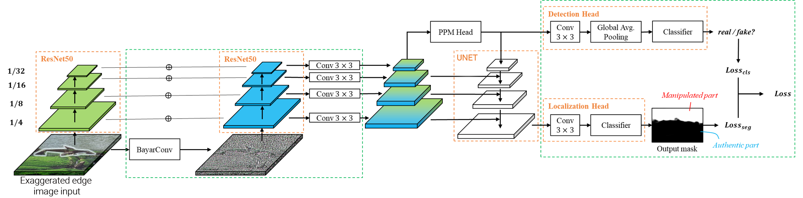

# Deep-fake-Forensics-Challenge
Shallow- and Deep- fake Image Manipulation 
Localization Using Deep Learning 
==> 

# Shallow- and Deep-Fake Image Manipulation Localization

## Overview

This repository contains the code and documentation for the CS Challenge on Shallow- and Deep-Fake Image Manipulation Localization Using Deep Learning. The challenge involves replicating and enhancing the results of a research paper, drafting a scientific paper, and formulating a startup idea.

## Scientific Paper

The `scientific_paper/` directory contains the comprehensive scientific paper that documents the work conducted. Please refer to this section for a detailed overview of the research methodology, results, and conclusions.

## Table of Contents

- [Reproduce Results](#reproduce-results)
- [Enhance Results](#enhance-results)
- [Scientific Paper](#scientific-paper)
- [Getting Started](#getting-started)

## Preparation 
To begin, you will need to clone this GitHub repository :
```bash
git clone https://github.com/Goodnight77/Deep-fake-Forensics-Challenge.git
```
## Dataset
The hole dataset we used to train our model can be downloaded from kaggle using this [link](https://www.kaggle.com/datasets/mohamedbenticha/tsyp-cs-challenge).

## Train/Val/Test
The way (file paths) of how we split the datasets into train/val/test subsets can be downloaded [link](https://www.dropbox.com/s/opjpz9hoy5xm4um/paths.zip?dl=0).

## Reproduce Results
To replicate the outcomes of the research paper, follow the instructions in the `` directory. This includes training deep learning models on the provided dataset and evaluating them using the designated test set.


## Getting Started

Follow these steps to get started with the project:

1. Clone the repository: `git clone https://github.com/Goodnight77/Deep-fake-Forensics-Challenge`
2. Navigate to the relevant directories for each challenge.
3. Follow the instructions provided in each directory to replicate, enhance, and document the results.
